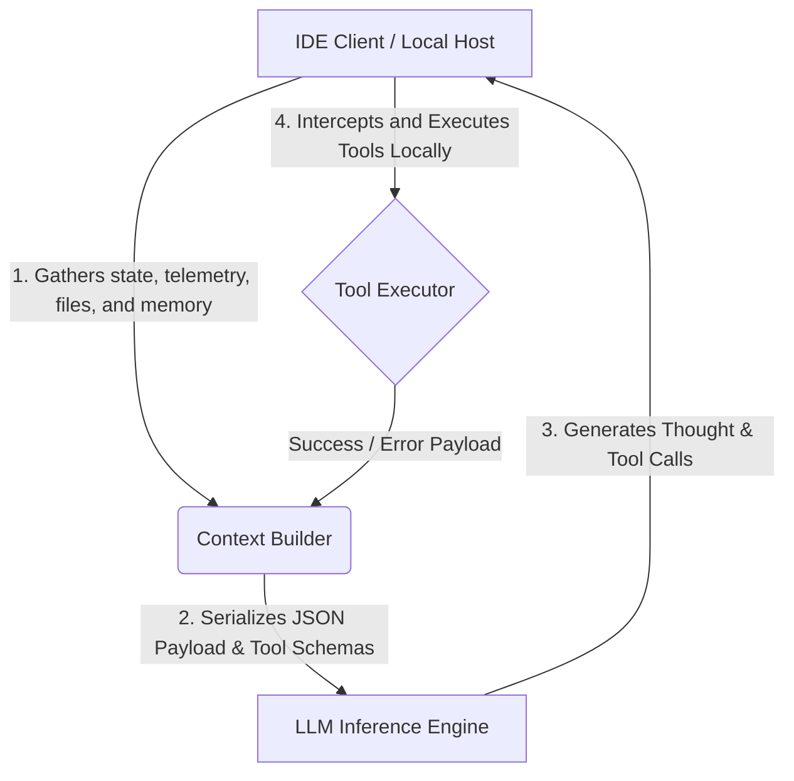

# AI Agent Workflows & System Architecture Knowledge Base

This repository is a product of ongoing research and conversations with different AI agents, created to understand their workflows, system physics, and orchestration paradigms. It is a public resource for anyone who has gathered similar data and wishes to contribute.

Rather than high-level tutorials, this project documents the low-level systems engineering behind autonomous AI agents.

---

## 1. The Core Paradigm: The Stateless LLM & The Stateful Orchestrator

The foundational principle undergirding modern AI agent architectures is the **Stateless Client-Server Split**. 

* **The LLM as a Swappable CPU:** The AI model itself is entirely stateless, possessing no persistent memory of prior interactions or session-specific context.
* **The Client as the Agent:** The true "agent" is the local orchestration engine (typically integrated within an IDE or developer workflow tool). It is responsible for maintaining state, managing file system access, running local terminals, executing sandboxed commands, and structuring memory.
* **Dynamic Context Assembly:** Every interaction in a session involves the local orchestrator reconstructing the entire agent state, tool definitions, workspace metadata, and conversational history, and transmitting it as a single flat payload to the LLM.

---

## 2. Core Architectural Pillars

The knowledge base is organized around several critical vectors of AI agent system design:

### A. Context Assembly & Startup Physics
Before an agent processes a user prompt, the orchestration layer builds a system payload consisting of multiple distinct segments:
* **Base Identity & Operational Instructions:** Structural constraints defining behavioral boundaries, formatting standards, and output requirements.
* **Tool Declarations:** JSON schemas translating available system actions (e.g., file reads, terminal executions, web searches) into the model's function-calling registry.
* **Workspace Telemetry:** Real-time environment discovery, exposing directory trees, active projects, system architecture, and local environment variables.
* **Retrieval-Augmented Memory (RAG):** Injection of localized Knowledge Items (KIs) and historical conversation rollups to bridge the gap between static training data and session history.

### B. The Multi-Turn Agentic Tool Loop
Once the context payload is assembled, the model executes a cyclic reasoning-action process:
1. **Cognitive Grounding:** The model generates a structured, internal reasoning sequence (e.g., a `<thought>` block) to plan actions before generating output.
2. **Tool Invocation & Halting:** When the model generates a function call, execution halts. The model yields control back to the client-side orchestrator.
3. **Client-Side Interception:** The host environment validates the tool parameters, requests user approval (if required), and executes the action natively on the local file system, terminal, or network.
4. **State Re-injection:** The output of the tool is serialized and appended back to the conversation array as a system response, and the loop repeats.

### C. Subsequent Request Telemetry & Context Degradation
As a conversation progresses, the context window expands, introducing complex engineering challenges:
* **Attention Decay ("Lost in the Middle"):** LLM attention mechanisms degrade in accuracy when processing large context windows, occasionally missing rules or data located in the middle of long arrays.
* **Cognitive Drift & Over-Steering:** A long sequence of human-agent dialogue can skew the agent's attention toward past conversational states, causing it to deviate from initial instructions.
* **Delta Telemetry Updates:** The orchestrator continuously injects real-time client metadata changes (e.g., active files, cursor positions, open editor tabs) to align the agent's spatial awareness with the developer's focus.
* **Amnesia & Checkpoint Events:** To prevent token limit exhaustion, the client must periodically compress or summarize older parts of the conversation. This "checkpoint" deletes raw history, forcing the agent to rely on generated summaries or re-read the workspace to regain lost granular details.

### D. Model Switching & Schema Translation
To optimize for cost, speed, and capabilities, workflows frequently transition between different LLM backends mid-session. This requires a **Stateless Brain Transplant**:
* **Universal Translation Layer:** The client must dynamically translate the conversation history and tool execution arrays between different provider schemas (e.g., converting Google's `functionDeclarations` to Anthropic's or OpenAI's tool format) without losing historical continuity.
* **Behavioral Drift:** Swapping models swaps the underlying cognitive engine. A new model may interpret the historical context differently, leading to sudden shifts in output style, tool usage frequency, or execution aggressiveness.

### E. Environment & Subagent Orchestration
Complex tasks require the agent to spawn autonomous sub-processes or delegate tasks to specialized environments:
* **Browser Subagents:** Spawning sandboxed browser instances to perform UI automation, DOM extraction, and visual verification via screenshots.
* **Sandbox Execution:** Running untrusted code, testing suites, or terminal commands in isolated containers to protect the host machine while capturing execution logs.
* **Telemetry & Handshakes:** Designing communication protocols to serialize state and return results from sub-processes back to the primary orchestrator.

### F. Self-Healing & Compile-Test Loops
To achieve high-fidelity code generation, the agent incorporates feedback loops:
* **Linter & Compiler Integration:** Automatically feeding back syntax errors, typescript compilations, and test failures directly into the agent's next thought phase.
* **Self-Healing Patches:** Generating granular AST-based code replacements, executing them, evaluating the errors, and iterating autonomously until completion.

---

## 3. Taxonomy of the Knowledge Base

To contribute or navigate through this reference library, documents are categorized under the following operational taxonomy:

| Category | Description | Key Focus Areas |
| :--- | :--- | :--- |
| **Initialization & Runtime** | The boot sequence and spatial awareness of the agent. | Startup scripts, telemetry injection, workspace tree resolution. |
| **Cognitive State & Memory** | How the agent retains context, handles amnesia, and manages tokens. | Checkpoints, RAG mechanisms, context window dilution, attention decay. |
| **Execution & Sandbox** | Tool execution protocols, containerization, and automation. | Terminal simulation, browser orchestration, subagent lifecycles. |
| **Orchestration & Routing** | Managing models, switching providers, and delegating subtasks. | Schema translation, behavioral drift, token-saving routing. |
| **Resilience & Feedback** | How the system detects, analyzes, and repairs failures. | Compiler loops, linter integrations, self-correction strategies. |

---

> [!NOTE]
> This knowledge base is intended for software engineers, systems architects, and researchers building state-of-the-art developer tooling and agentic systems. It documents the underlying "physics" of agent execution, serving as a blueprint for engineering robust, resilient, and highly autonomous AI systems.
